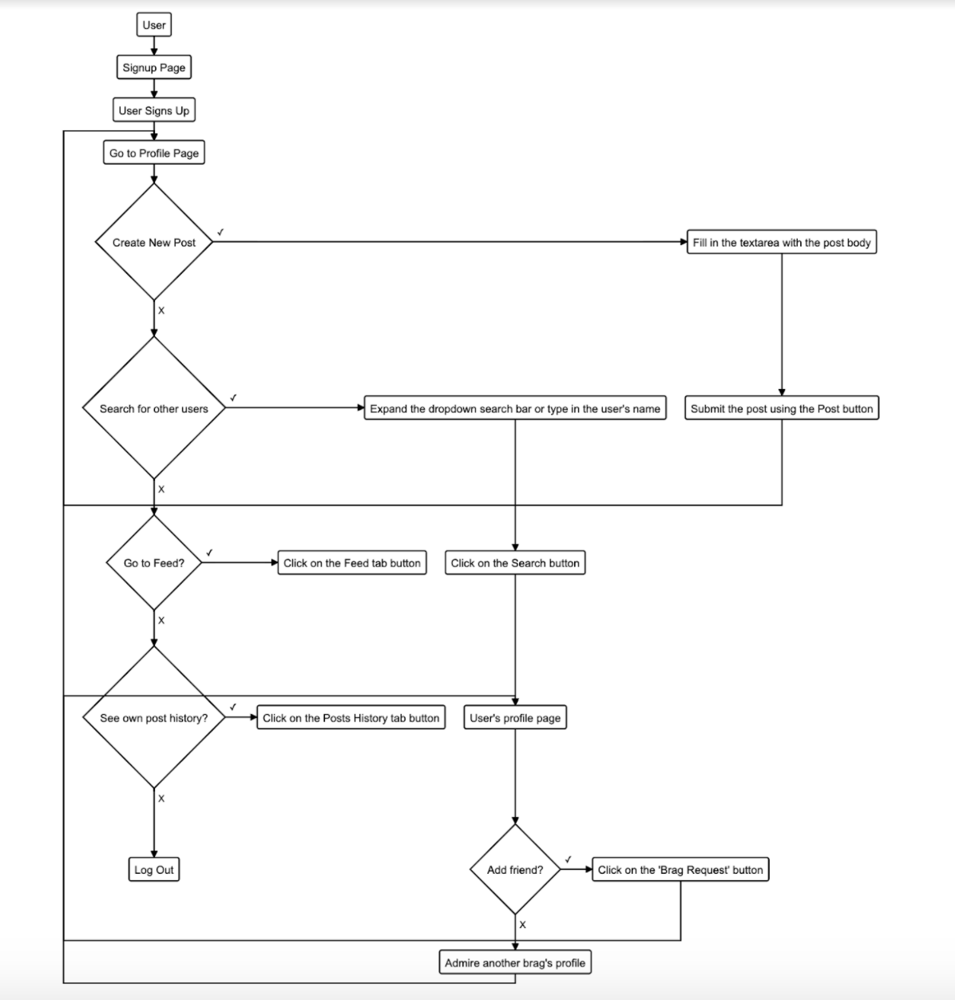
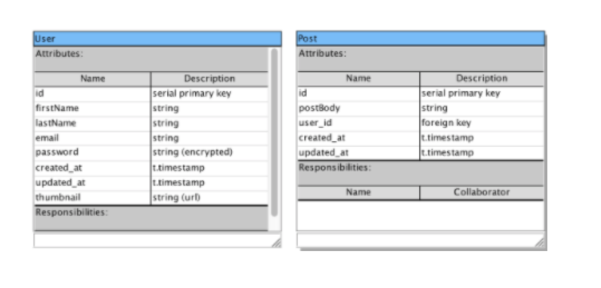
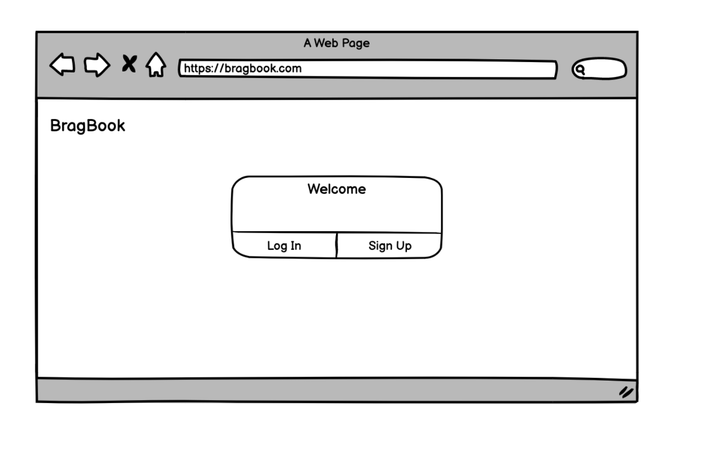
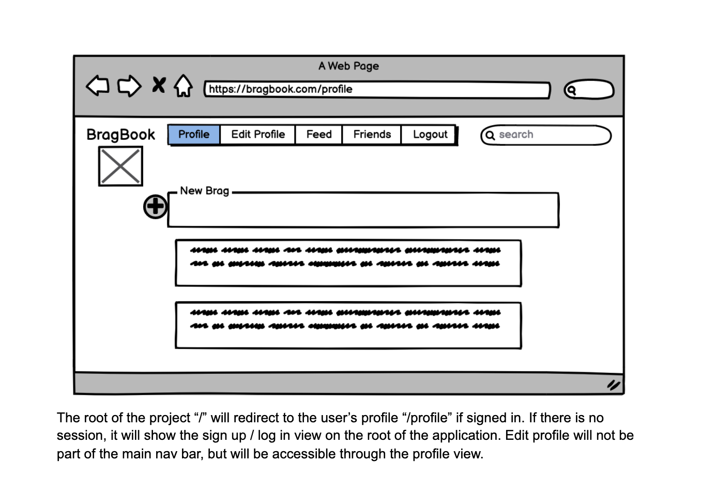
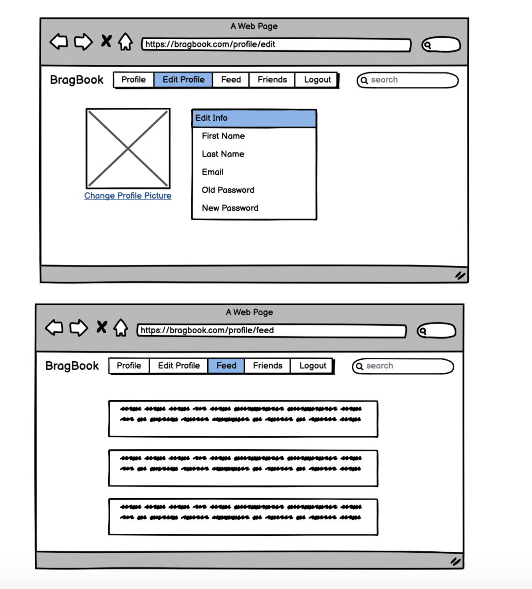
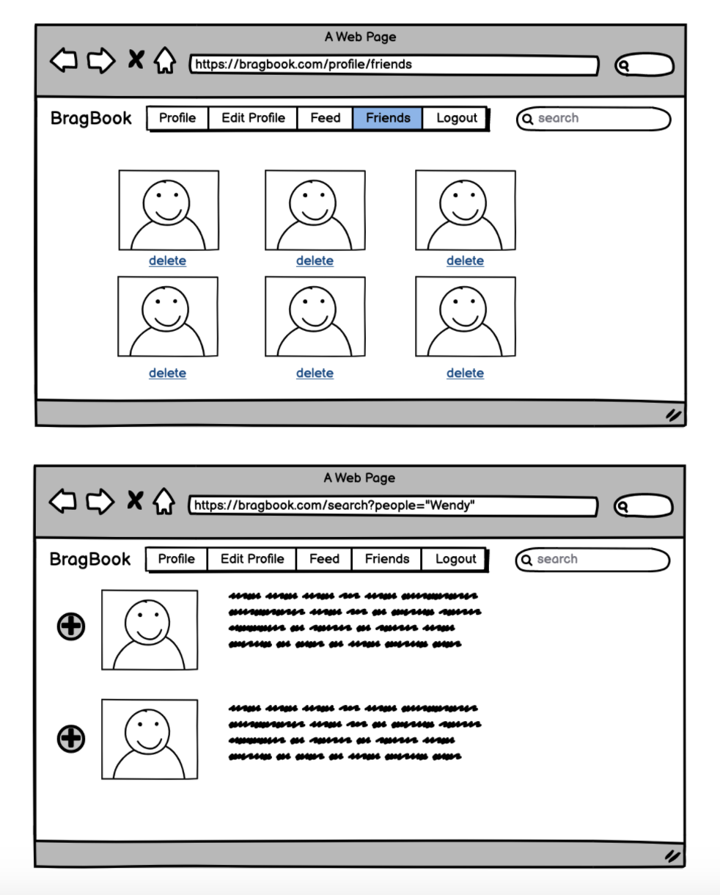

# <u>BragBook</u>

## <u>About</u>
BragBook is a site that allows people to connect with friends and share what is going on in their lives. Users can do this through creating posts, uploading a profile picture and adding multiple friends. BragBook also allows users to comment on their friend's post and respond via likes and various emojis. The web app is made using the following tech stack: Ruby, Rails, RSpec + Capybara, HTML, CSS (w/ bootstrap), JS. The app was deployed to [Heroku](https://bragbook.herokuapp.com) via Travis CI.

## Project Contributors


| [Mel TheCommitPolice](https://github.com/TamMelPer) |
[Symion OopsWendyDidItAgain](https://github.com/sedwards93) |
[Constantine WishWeHadDoneThisInC#](https://github.com/CodeZeus-dev) |
[Michael GMT+8](https://github.com/Michaelschats) |

## View project on Heroku:
[BragBook](https://bragbook.herokuapp.com)

## <u>Setup:</u>
1. Fork this repository `acebook-BragBook` and customize
the below**

2. Clone the repository and follow below:

```bash
      > bundle install
      > bin/rails db:create
      > bin/rails db:migrate

      > bundle exec rspec # Run the tests to ensure it works
      > bin/rails server # Start the server at localhost:3000
```

## How to contribute to this project
[CONTRIBUTING.md](CONTRIBUTING.md)


### <u>User Stories</u>
```
As a Bragger
So that I can show off about my life
I want to be able to sign up for BragBook

As a Bragger
So that I can continue showing off my life
I want to be able to log into BragBook

As a Bragger
So that I can let people know what I am doing  
I want to be able to create post

As a Bragger
So that I can keep track of my exciting life
I want to see my posts in reverse-chronological order

As a Bragger
So that I can rewrite history
I want to be able to delete posts on my page

As a Bragger
So that I can find the person I am looking for
I want to be able to see a list of all Bragbook users

As a Bragger
So that I can keep tabs on my “friends”
I want to be able to add friends to my friends list

As a Bragger
So people can see my beautiful face
I want to be able to upload a profile picture

As a Bragger
So that I can let my friends know I care about their interests
I want to be able to comment on their posts

As a Bragger
So that I can let my friends know I really care about their interests
I want to be able to like their posts
```

### <u>Planning:</u>
#### User Flowchart:
In the initial planning stage we created this flow chart to help visualise the user journey.

#### Class Diagrams
During planning we drafted class diagrams to aid the creation of our databases.

#### StoryBoard:
We created basic mock-ups of each of our pages to guide us through front-end design.





### <u>Features:</u>
- ✅ Sign-up, Login & Sign-out
- ✅ CRUD posts
- ✅ Displays posts history
- ✅ Adding Braggers
- ✅ Viewing other Braggers Profiles
- ✅ Commenting on Posts
- ✅ Profile Picture
- ✅ Liking posts && comments

###### <u>Features we would like to implement going forward</u>
- 🔮 Instant Messaging
- 🔮 Devise Email reset Integration
